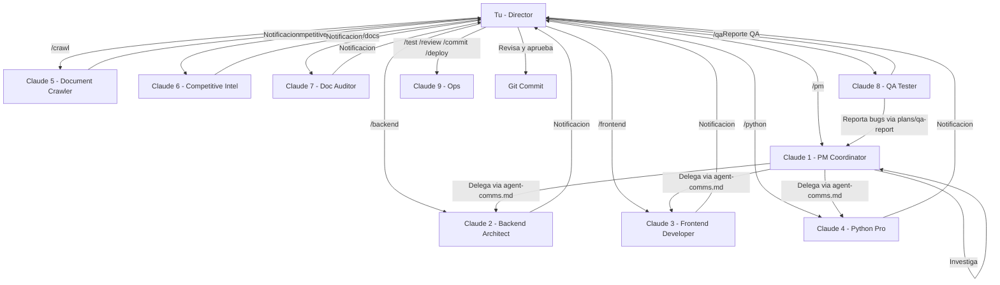

# 🎮 Guía de Trabajo Multi-Agente con Claude Code

> **Basado en:** [El flujo de trabajo de Boris Cherny](https://wwwhatsnew.com/2026/01/08/como-boris-cherny-usa-cinco-agentes-a-la-vez/) (Responsable de Claude Code en Anthropic) y [Anthropic Engineering: Effective Harnesses for Long-Running Agents](https://www.anthropic.com/engineering/effective-harnesses-for-long-running-agents)

---

## 📋 Tabla de Contenidos

1. [Concepto General](#concepto-general)
2. [Estructura de Archivos](#estructura-de-archivos)
3. [Slash Commands Disponibles](#slash-commands-disponibles)
4. [Flujo de Trabajo Diario](#flujo-de-trabajo-diario)
5. [Trabajo en Paralelo (5 Agentes)](#trabajo-en-paralelo-5-agentes)
6. [Memoria Compartida](#memoria-compartida)
7. [Mejores Prácticas](#mejores-prácticas)
8. [Troubleshooting](#troubleshooting)

---

## 🎯 Concepto General

### El Cambio de Mentalidad

En lugar de **"teclear más rápido"**, el objetivo es **"coordinar mejor"**. 

Piensa en ti mismo como un **director de orquesta** que:
- Distribuye tareas a múltiples agentes
- Recibe notificaciones cuando cada uno termina
- Toma decisiones estratégicas
- Verifica resultados

### Por qué funciona

| Problema tradicional | Solución multi-agente |
|---------------------|----------------------|
| Esperas mientras compila | Otro agente trabaja en otra tarea |
| Pierdes contexto entre sesiones | `claude-progress.txt` mantiene memoria |
| Repites instrucciones constantemente | `CLAUDE.md` + slash commands |
| El agente "se olvida" de tus preferencias | Memoria acumulativa en archivos |

---

## 📁 Estructura de Archivos

```
TaxIA/
├── CLAUDE.md                     # Manual del proyecto (compartido)
├── CLAUDE.local.md               # Config personal (no se sube a Git)
├── claude-progress.txt           # Log de progreso entre sesiones
├── plans/                        # Roadmap y decisiones arquitectonicas
│   ├── ROADMAP.md                # Roadmap de desarrollo
│   └── DECISIONS.md              # Architecture Decision Records (ADR)
└── .claude/
    ├── commands/                 # Slash commands (entry points)
    │   ├── start.md              # /start → Iniciar sesion
    │   ├── pm.md                 # /pm → PM Coordinator (NUEVO)
    │   ├── backend.md            # /backend → Backend Architect
    │   ├── frontend.md           # /frontend → Frontend Developer
    │   ├── python.md             # /python → Python Pro
    │   ├── crawl.md              # /crawl → Document Crawler
    │   ├── competitive.md        # /competitive → Competitive Intelligence
    │   ├── docs.md               # /docs → Documentation Auditor
    │   ├── qa.md                 # /qa → QA Tester E2E (Playwright)
    │   ├── test.md               # /test → Ejecutar tests
    │   ├── commit.md             # /commit → Commit con convencion
    │   ├── review.md             # /review → Code review
    │   ├── deploy.md             # /deploy → Preparar deployment
    │   ├── sync.md               # /sync → Sincronizar agentes
    │   ├── workspace.md          # /workspace → Gestionar workspaces
    │   └── files.md              # /files → Gestionar archivos
    ├── agents/                   # Agentes especializados (YAML frontmatter)
    │   ├── pm-coordinator.md     # PM / Tech Lead (skills: research, roadmap)
    │   ├── backend-architect.md  # Backend Architect (FastAPI, DB, security)
    │   ├── frontend-dev.md       # Frontend Developer (React, TS, CSS)
    │   ├── python-pro.md         # Python Pro (optimization, debugging)
    │   ├── doc-crawler.md        # Document Crawler (fiscal docs)
    │   ├── competitive-intel.md  # Competitive Intelligence (market analysis)
    │   ├── doc-auditor.md        # Documentation Auditor (CLAUDE.md, README)
    │   └── qa-tester.md          # QA Tester E2E (Playwright MCP + scripts)
    ├── skills/                   # Skills reutilizables
    │   ├── irpf-calculation.md
    │   ├── sse-streaming.md
    │   ├── turso-patterns.md
    │   ├── security-layers.md
    │   ├── stripe-integration.md
    │   ├── deployment-railway.md
    │   ├── project-research/SKILL.md   # Research web (PM skill)
    │   ├── roadmap-manager/SKILL.md    # Roadmap CRUD (PM skill)
    │   └── playwright-testing/SKILL.md # E2E testing (QA skill)
    └── subagents/                # [LEGACY] Backward compatibility
        └── ...
```

> **Patron: Command → Agent → Skill** — Los commands son entry points que cargan agentes. Los agentes usan skills como conocimiento especializado. Basado en [claude-code-best-practice](https://github.com/shanraisshan/claude-code-best-practice).

### Descripcion de cada componente

| Componente | Proposito | Se sube a Git |
|-----------|-----------|---------------|
| `CLAUDE.md` | Contexto completo del proyecto, arquitectura, convenciones | Si |
| `.claude/commands/*.md` | Entry points para activar agentes y workflows | Si |
| `.claude/agents/*.md` | Definiciones de agentes con YAML frontmatter | Si |
| `.claude/skills/*.md` | Conocimiento especializado reutilizable | Si |
| `plans/ROADMAP.md` | Roadmap de desarrollo con prioridades | Si |
| `plans/DECISIONS.md` | Log de decisiones arquitectonicas (ADR) | Si |
| `agent-comms.md` | Canal de comunicacion inter-agente | Si |
| `memory/` | Memoria persistente por tema | Si |

---

## ⚡ Slash Commands Disponibles

### `/start` - Iniciar Sesión
**Ejecutar siempre al comenzar una nueva sesión de Claude Code.**

Qué hace:
1. Ejecuta `init.sh` para verificar el entorno
2. Lee `claude-progress.txt` para saber qué se hizo antes
3. Revisa los últimos commits de Git
4. Te pregunta qué tarea quieres abordar

```
> /start
```

---

### `/test` - Ejecutar Tests
Ejecuta el suite de tests del backend y reporta resultados.

```
> /test
```

Salida esperada:
- ✅ Tests pasando
- ❌ Tests fallando con detalles
- Sugerencias de corrección si hay fallos

---

### `/commit` - Commit con Convención
Hace commit siguiendo la convención del proyecto.

```
> /commit
```

Convención de commits:
- `feat:` Nueva funcionalidad
- `fix:` Corrección de bug
- `docs:` Documentación
- `refactor:` Refactorización
- `test:` Tests
- `chore:` Mantenimiento

---

### `/review` - Code Review
Analiza los cambios pendientes antes de hacer commit.

```
> /review
```

Revisa:
- Convenciones de código
- Errores de lógica
- Tests faltantes
- Código duplicado
- Console.log/print olvidados

---

### `/deploy` - Preparar Deployment
Prepara el proyecto para desplegar a Railway.

```
> /deploy
```

Pasos que ejecuta:
1. Verifica que no hay cambios sin commitear
2. Ejecuta tests
3. Verifica que el frontend compila
4. Push a la rama actual
5. Railway detecta el push y despliega

---

### `/workspace` - Gestionar Workspaces
Gestiona los espacios de trabajo del usuario para organizar documentos fiscales.

```
> /workspace
```

Acciones disponibles:
- Listar workspaces existentes
- Crear nuevo workspace
- Ver detalles y archivos de un workspace
- Eliminar workspace

Los workspaces permiten tener contexto personalizado en las consultas del chat.

---

### `/files` - Gestionar Archivos
Gestiona los archivos dentro de un workspace activo.

```
> /files
```

Acciones disponibles:
- Listar archivos del workspace
- Subir nuevo archivo (PDF, Excel)
- Ver contenido extraido
- Eliminar archivo

Tipos soportados: nominas, facturas, declaraciones, otros documentos fiscales.

---

## 📅 Flujo de Trabajo Diario

### Al Comenzar el Día

```mermaid
    A[Abrir Terminal] --> B[cd proyecto]
    B --> C[claude]
    C --> D[/start]
    D --> D1[Leer task.md e implementation_plan.md]
    D1 --> E{¿Qué hacer?}
    E --> F[Nueva feature (Ver Plan)]
    E --> G[Bug fix]
    E --> H[Tests]
    E --> I[Docs]
```

### Durante el Trabajo

1. **Pide a Claude que haga una tarea específica**
   ```
   > Implementa un endpoint GET /api/users que devuelva la lista de usuarios
   ```

2. **Claude trabaja y propone cambios**
   - Muestra los archivos que va a modificar
   - Pide confirmación antes de ejecutar comandos

3. **Revisa los cambios**
   ```
   > /review
   ```

4. **Si todo está bien, commitea**
   ```
   > /commit
   ```

### Al Terminar el Día

1. **Asegúrate de commitear todo**
   ```
   > /commit
   ```

2. **Actualiza el archivo de progreso**
   Claude lo hace automáticamente, pero puedes pedirle:
   ```
   > Actualiza claude-progress.txt con lo que hicimos hoy
   ```

3. **Opcional: Deploy**
   ```
   > /deploy
   ```

---

## Trabajo en Paralelo (9 Agentes)

### El Setup de Boris Cherny (ampliado con PM Coordinator + QA Tester)

Boris Cherny (responsable de Claude Code en Anthropic) trabaja con **5 terminales de Claude en paralelo**, cada una asignada a una tarea diferente. Nosotros lo ampliamos a **9 agentes especializados** siguiendo el patron Command → Agent → Skill.

### Como Replicarlo

**Terminal 1 - PM Coordinator** (`/pm`) — NUEVO
```powershell
cd "ruta/al/proyecto"
claude
> /pm
> Dashboard / Research {tema} / Roadmap / Delegate {tarea}
```

**Terminal 2 - Backend** (`/backend`)
```powershell
cd "ruta/al/proyecto"
claude
> /backend
> Implementa el nuevo endpoint para fiscal profile
```

**Terminal 3 - Frontend** (`/frontend`)
```powershell
cd "ruta/al/proyecto"
claude
> /frontend
> Crea la UI del formulario fiscal con pestanas
```

**Terminal 4 - Python Pro** (`/python`)
```powershell
cd "ruta/al/proyecto"
claude
> /python
> Optimiza el pipeline de RAG para reducir latencia
```

**Terminal 5 - Document Crawler** (`/crawl`)
```powershell
cd "ruta/al/proyecto"
claude
> /crawl
> Rastrear documentos de Navarra y Gipuzkoa
```

**Terminal 6 - Competitive Intelligence** (`/competitive`)
```powershell
cd "ruta/al/proyecto"
claude
> /competitive
> Compara Impuestify con TaxDown en todas las categorias
```

**Terminal 7 - Documentation Auditor** (`/docs`)
```powershell
cd "ruta/al/proyecto"
claude
> /docs
> Auditoria / Actualizar CLAUDE.md / Full sync
```

**Terminal 8 - QA Tester E2E** (`/qa`)
```powershell
cd "ruta/al/proyecto"
claude
> /qa
> Full / Quick / Particular / Autonomo / Explore {url}
```

**Terminal 9 - Tests/Deploy/Review**
```powershell
cd "ruta/al/proyecto"
claude
> /test → Ejecutar tests unitarios
> /review → Code review
> /commit → Git commit
> /deploy → Railway deployment
```

### El Flujo



---

## 🧠 Memoria Compartida

### El Problema de la "Amnesia"

Los LLMs no recuerdan sesiones anteriores. Cada vez que inicias Claude Code, empieza de cero.

### La Solución: Archivos de Memoria

#### `CLAUDE.md` - La "Nevera del Piso Compartido"

Como la hoja de papel pegada en la nevera de un piso compartido que dice:
- "No toques la leche de Juan"
- "Sacar la basura los martes"
- "El WiFi es: ..."

En `CLAUDE.md` pones:
- Arquitectura del proyecto
- Convenciones de código
- Decisiones arquitectónicas importantes
- Cómo correr tests, builds, deploys

#### `claude-progress.txt` - El "Cuaderno de Bitácora"

Cada sesión de Claude debería actualizar este archivo al terminar:

```markdown
[2026-01-11] [Session 3] - Implementación de OAuth2
- Creado endpoint /auth/google
- Añadido GoogleAuthProvider
- Tests añadidos: test_oauth.py
- TODO: Falta implementar refresh tokens
```

El siguiente agente que entre puede leer esto y saber exactamente dónde continuar.

### Efecto Acumulativo

```
Semana 1: CLAUDE.md tiene 50 líneas
Semana 4: CLAUDE.md tiene 200 líneas
Mes 3:    CLAUDE.md tiene 500 líneas → Claude conoce TODO sobre el proyecto
```

Cuanto más tiempo trabajas, más útil se vuelve el sistema.

---

## ✅ Mejores Prácticas

### DO ✅

1. **Siempre ejecuta `/start` al comenzar**
   - Claude se pone al día rápidamente
   - Evitas repetir contexto

2. **Usa `/review` antes de `/commit`**
   - Captura errores antes de que lleguen a Git

3. **Actualiza `claude-progress.txt` al terminar**
   - El siguiente agente (o tú mañana) lo agradecerá

4. **Usa tareas específicas, no vagas**
   - ❌ "Mejora el código"
   - ✅ "Refactoriza el módulo auth.py para separar JWT de OAuth"

5. **Verifica siempre el trabajo de Claude**
   - Los agentes pueden cometer errores
   - Revisa los cambios antes de aprobar

### DON'T ❌

1. **No ignores las notificaciones**
   - Si Claude termina y tú no respondes, pierde el contexto

2. **No olvides hacer commit antes de cerrar**
   - Perderás el trabajo si la sesión se cierra

3. **No pidas "hazlo todo de una vez"**
   - Es mejor trabajo incremental, feature por feature

4. **No modifiques archivos mientras Claude trabaja en ellos**
   - Causará conflictos

---

## 🔧 Troubleshooting

### Claude no reconoce los slash commands

**Problema:** Escribes `/start` pero Claude no lo ejecuta.

**Solución:** 
- Verifica que `.claude/commands/` existe y tiene los archivos `.md`
- Reinicia Claude Code: `exit` y luego `claude`

---

### Claude "se olvida" del contexto

**Problema:** Después de mucho trabajo, Claude parece confundido.

**Solución:**
- El contexto window se llenó
- Claude compacta automáticamente, pero puede perder detalles
- Pídele: "Lee CLAUDE.md y claude-progress.txt para refrescar contexto"

---

### Los cambios no se guardan

**Problema:** Claude dice que modificó un archivo pero no hay cambios.

**Solución:**
- Claude necesita tu aprobación para modificar archivos
- Revisa si hay prompts pendientes de "Approve?"
- Di `y` o `yes` para aprobar

---

### El proyecto no compila después de cambios de Claude

**Problema:** Claude hizo cambios que rompieron el build.

**Solución:**
```
> /test
> Si hay errores, corrígelos
```

O usa Git para revertir:
```bash
git diff  # Ver qué cambió
git checkout -- archivo.py  # Revertir un archivo
git reset --hard HEAD  # Revertir TODO (¡cuidado!)
```

---

## 📚 Referencias

- [Boris Cherny - 5 Agentes en Paralelo](https://wwwhatsnew.com/2026/01/08/como-boris-cherny-usa-cinco-agentes-a-la-vez/)
- [Anthropic - Effective Harnesses for Long-Running Agents](https://www.anthropic.com/engineering/effective-harnesses-for-long-running-agents)
- [Claude Code Documentation](https://docs.anthropic.com/en/docs/claude-code)
- [GitHub Quickstart - Autonomous Coding](https://github.com/anthropics/claude-quickstarts/tree/main/autonomous-coding)

---

**Ultima actualizacion:** 2026-03-05
**Autor:** Fernando Prada - AI Tech Lead / AI Engineer.
