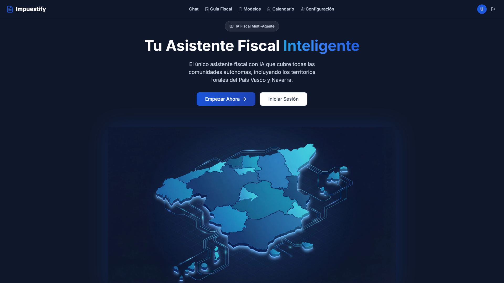
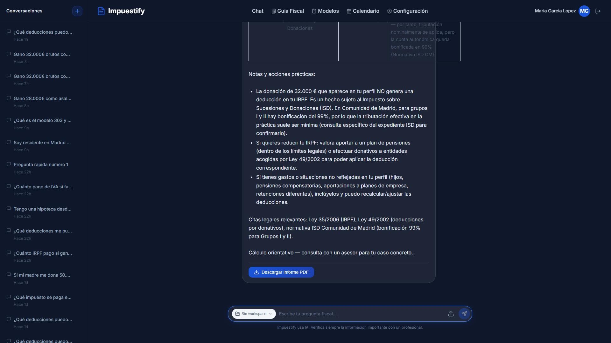
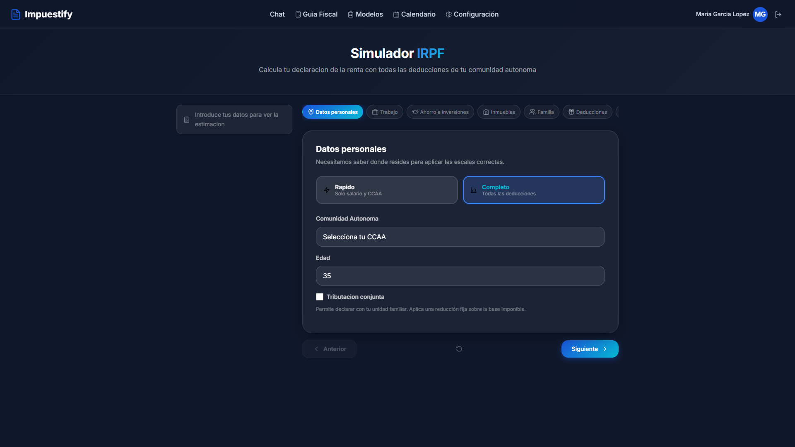
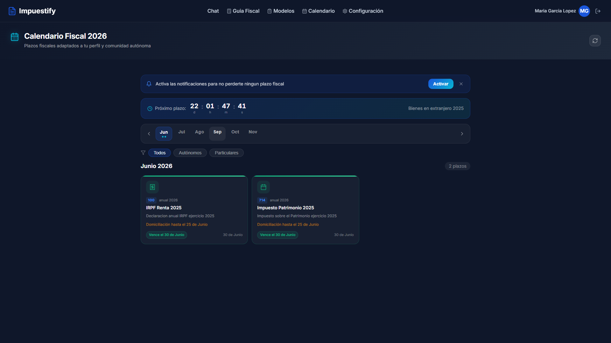

<div align="center">


# Impuestify

### El copiloto fiscal con IA para toda España

*Declara, defiende y digitaliza tu fiscalidad sin pelearte con Hacienda.*

[](https://impuestify.com)
[](https://impuestify.com#pricing)
[](#-cobertura-fiscal-completa)

<br/>

[](https://impuestify.com)
[](https://python.org)
[](https://react.dev)
[](https://typescriptlang.org)
[](https://railway.app)
[](LICENSE)

</div>

---

## 🚀 Por qué Impuestify

> Hacienda habla en 21 lenguas fiscales distintas. Impuestify las habla todas.

- 🧠 **GPT-5-mini + RAG sobre 463 documentos oficiales** (AEAT, BOE, 4 Diputaciones Forales).
- 🗺️ **21 territorios cubiertos al 100 %** — 15 CCAA + 4 forales + Ceuta y Melilla.
- 🛡️ **DefensIA** — defensor fiscal automatizado con motor anti-alucinación (30 reglas + RAG verificador).
- 🧾 **Clasificador de facturas con OCR Gemini** — 0,0003 € por factura, contabilidad PGC automática.
- 📊 **Simulador IRPF completo** — 8 sub-calculadoras, tributación conjunta, ~1.008 deducciones.
- 🏢 **Modelo 200 IS** — simulador Impuesto sobre Sociedades para SL/SA (7 territorios).
- 🔒 **13 capas de seguridad** — LlamaGuard4, prompt injection, PII, MFA, CAPTCHA.

<div align="center">

**[👉 Probar gratis en impuestify.com](https://impuestify.com)**

</div>

---

## 🧩 Todo lo que hace Impuestify

<table>
<tr>
<td width="50%" valign="top">

### 💬 Chat fiscal inteligente
Pregunta en lenguaje natural y recibe respuestas con citas a la legislación oficial. Streaming SSE en tiempo real, persistencia de conversaciones, detección automática de perfil fiscal.

### 🧮 Simulador IRPF
8 sub-calculadoras: trabajo, ahorro, inmuebles, MPYF, actividades, renta imputada, pérdidas y cripto FIFO. Tributación conjunta, forales (vasco 7 tramos, navarra 11) y Ceuta/Melilla 60 %.

### 🏢 Modelo 200 — Impuesto sobre Sociedades
Simulador IS para SL, SA y empresas de nueva creación. Régimen común + 4 forales + ZEC + Ceuta/Melilla. Pagos fraccionados Modelo 202 y PDF borrador con 16 casillas.

### 🛡️ DefensIA — Defensor fiscal
Sube la liquidación o el requerimiento, DefensIA extrae los datos con Gemini, aplica 30 reglas deterministas validadas contra jurisprudencia, verifica con RAG y redacta el escrito. Export DOCX/PDF con disclaimer legal.

</td>
<td width="50%" valign="top">

### 📸 Clasificador de facturas
OCR con Gemini 3 Flash Vision, clasificación PGC (201 cuentas), asientos en partida doble, libros Diario/Mayor/Balance/PyG, export CSV/Excel para Registro Mercantil.

### 🔭 Guía Fiscal Adaptativa
Wizard 7–8 pasos que se adapta al perfil (Particular, Autónomo, Creator) y a tu CCAA. Estimador en vivo de cuota IRPF (~50 ms, sin LLM).

### 🧰 6 calculadoras públicas
Sueldo neto, retenciones IRPF, umbrales contables, obligaciones fiscales, obligado a declarar, checklist borrador — gratis, sin registro.

### 🗂️ Workspaces contables
Dashboard visual con KPIs, barras IVA trimestral, evolución de ingresos/gastos, tabla PGC, top proveedores. Auto-detección emitidas/recibidas por NIF.

</td>
</tr>
</table>

---

## 🌍 Cobertura fiscal completa

<div align="center">


*21 territorios fiscales · 1.008 deducciones · régimen común + 4 forales + Ceuta/Melilla*

</div>

| Territorio | Régimen IRPF | Modelos IVA | Sucesiones/Donaciones | Estado |
|:-----------|:------------|:------------|:----------------------|:------:|
| 15 CCAA régimen común | Estatal + autonómico | 303, 390 | Específicas por CCAA | ✅ 100 % |
| País Vasco (Álava, Bizkaia, Gipuzkoa) | 7 tramos foral | 303 / 300 Gipuzkoa | Normativa foral | ✅ 100 % |
| Navarra | 11 tramos foral | F69 | Normativa foral | ✅ 100 % |
| Canarias | Común | 420 IGIC | Específica | ✅ 100 % |
| Ceuta / Melilla | 60 % bonificación | IPSI (6 tipos) | Específica | ✅ 100 % |

---

## 💰 Planes y precios

<table>
<tr>
<td width="33%" align="center" valign="top">

### 👤 Particular
**5 € / mes**

Asalariados y pensionistas

✅ Chat fiscal ilimitado<br/>
✅ Simulador IRPF completo<br/>
✅ Análisis de nóminas<br/>
✅ Deducciones básicas<br/>
✅ Guía fiscal adaptativa<br/>
❌ Autónomo/Creator tools

</td>
<td width="33%" align="center" valign="top">

### 💼 Autónomo
**39 € / mes** *(IVA incl.)*

Trabajadores por cuenta propia

✅ Todo lo del plan Particular<br/>
✅ Modelos 303/130/131/349<br/>
✅ Clasificador de facturas<br/>
✅ Contabilidad PGC completa<br/>
✅ Workspace + calendario fiscal<br/>
✅ Cripto FIFO + Modelos 720/721

</td>
<td width="33%" align="center" valign="top">

### 🎬 Creator
**49 € / mes**

YouTubers, streamers, influencers

✅ Todo lo del plan Autónomo<br/>
✅ IVA por plataforma<br/>
✅ Modelo 349 intracomunitario<br/>
✅ DAC7 + CNAE 60.39<br/>
✅ Perfiles multi-rol<br/>
✅ Soporte prioritario

</td>
</tr>
</table>

<div align="center">

*Stripe Checkout + Customer Portal. **Sin permanencia. Cancela cuando quieras.***

</div>

---

## 📸 Capturas

<div align="center">

<table>
<tr>
<td align="center"><br/><sub>Landing</sub></td>
<td align="center"><br/><sub>Chat fiscal con SSE</sub></td>
</tr>
<tr>
<td align="center"><br/><sub>Guía fiscal adaptativa</sub></td>
<td align="center"><br/><sub>Calendario fiscal autónomo</sub></td>
</tr>
</table>

</div>

---

## 🏗️ Arquitectura

<details>
<summary><b>Ver diagrama completo</b></summary>

```
┌────────────────────────────────────────────────────────────┐
│                         Frontend                           │
│  React 18 + Vite + TypeScript                              │
│                                                            │
│  /chat             SSE streaming conversacional            │
│  /guia-fiscal      Tax Guide Wizard + LiveEstimatorBar     │
│  /clasificador     Invoice OCR + PGC classification        │
│  /contabilidad     Libro Diario/Mayor/Balance/PyG          │
│  /defensia         Wizard reclamaciones + export DOCX/PDF  │
│  /modelo-200       Simulador IS + PDF borrador             │
└────────────────────────────┬───────────────────────────────┘
                             │
                             ▼  JWT + Rate Limit + 13 Security Layers
┌────────────────────────────────────────────────────────────┐
│                     FastAPI Backend                        │
│                                                            │
│  ┌──────────────────────────────────────────────────┐     │
│  │           CoordinatorAgent (Router)              │     │
│  └───┬────────┬────────────┬────────────┬──────────┘     │
│      │        │            │            │                │
│  ┌───▼──┐ ┌──▼─────┐ ┌────▼────┐ ┌────▼──────┐          │
│  │ Tax  │ │Payslip │ │  Notif. │ │ Workspace │          │
│  │Agent │ │ Agent  │ │  Agent  │ │   Agent   │          │
│  └──────┘ └────────┘ └─────────┘ └───────────┘          │
│                                                            │
│  ┌──────────────────────────────────────────────────┐     │
│  │              DefensIA Engine                     │     │
│  │  Gemini Extract → Rules R001-R030 →              │     │
│  │  RAG Verify → LLM Redactor (Jinja2)              │     │
│  └──────────────────────────────────────────────────┘     │
│                                                            │
│  ┌──────────────────────────────────────────────────┐     │
│  │              Modelo 200 IS Engine                │     │
│  │  Simulador 7 territorios + Modelo 202 + PDF      │     │
│  └──────────────────────────────────────────────────┘     │
│                                                            │
│  13 Tools + Gemini OCR + Contabilidad Service              │
└─────┬──────────┬──────────┬─────────┬──────────┬──────────┘
      │          │          │         │          │
      ▼          ▼          ▼         ▼          ▼
┌─────────┐ ┌────────┐ ┌───────┐ ┌────────┐ ┌────────┐
│  Turso  │ │Upstash │ │OpenAI │ │ Stripe │ │ Gemini │
│ SQLite  │ │ Redis  │ │  LLM  │ │Payments│ │  OCR   │
└─────────┘ └────────┘ └───────┘ └────────┘ └────────┘
```

</details>

### Stack técnico

| Capa | Tecnología |
|:-----|:-----------|
| **Frontend** | React 18, Vite 5, TypeScript 5, React Router, Lucide, Recharts, vanilla-cookieconsent v3 |
| **Backend** | FastAPI, Python 3.12+, Pydantic, Uvicorn, SlowAPI |
| **Datos** | Turso (SQLite distribuido), Upstash Redis, Upstash Vector |
| **IA** | OpenAI GPT-5-mini, Google Gemini 3 Flash Image, Groq (LlamaGuard4) |
| **Pagos** | Stripe Checkout + Customer Portal |
| **Email** | Resend (password reset, alertas) |
| **Infra** | Railway (auto-deploy), Cloudflare (DNS + Turnstile) |

### RAG pipeline

- **463 documentos** oficiales — AEAT, BOE, Diputaciones Forales.
- **92.393 chunks** indexados, **85.587 embeddings** (OpenAI `text-embedding-3-large`).
- **FTS5 + búsqueda semántica híbrida** con fallback de acentos y filtro territorial.
- **Crawler automatizado** — 90 URLs, 23 territorios, Scrapling anti-bot.

---

## 🛡️ Seguridad (13 capas)

<details>
<summary><b>Ver las 13 capas</b></summary>

| # | Capa | Herramienta |
|:-:|:-----|:-----------|
| 1 | Rate Limiting | SlowAPI + Upstash Redis |
| 2 | Security Headers | CSP, X-Frame-Options, XSS, Referrer-Policy |
| 3 | JWT Auth | Access + refresh tokens |
| 4 | CAPTCHA | Cloudflare Turnstile en Login / Register |
| 5 | MFA / 2FA | TOTP + backup codes |
| 6 | Prompt Injection | Llama Prompt Guard 2 via Groq |
| 7 | PII Detection | DNI/NIE, teléfonos, emails, IBAN |
| 8 | SQL Injection | Consultas parametrizadas + detección OWASP |
| 9 | Content Moderation | Llama Guard 4 (14 categorías) |
| 10 | Content Restriction | Contenido autónomo bloqueado para plan Particular |
| 11 | Semantic Cache | Upstash Vector, umbral 0,93, TTL 24 h |
| 12 | Guardrails | Validación input/output |
| 13 | Audit Logger | Registro inmutable |

</details>

---

## ⚡ Quick Start (desarrolladores)

### Requisitos

- Python 3.12+
- Node.js 18+
- API Keys: OpenAI, Turso, Upstash, Groq, Stripe, Resend, Google Gemini

### 1 · Clonar y configurar

```bash
git clone https://github.com/Nambu89/Impuestify.git
cd Impuestify
cp .env.example .env
# Editar .env con tus API keys (ver .env.example para la lista completa)
```

### 2 · Backend

```bash
cd backend
python -m venv venv
source venv/bin/activate   # Windows: venv\Scripts\activate
pip install -r requirements.txt

# Seed datos de referencia
python scripts/seed_estatal_scale.py
python scripts/seed_deductions.py
python scripts/seed_deductions_territorial.py
python scripts/seed_pgc_accounts.py
python scripts/seed_test_users.py

uvicorn app.main:app --reload --host 0.0.0.0 --port 8000
```

### 3 · Frontend

```bash
cd frontend
npm install
npm run dev         # http://localhost:5173
```

---

## 🧪 Testing

```bash
# Backend — ~1.800 tests (incluye 379 DefensIA + 47 Modelo 200)
cd backend && pytest tests/ -v

# Frontend — build check
cd frontend && npm run build

# E2E Playwright
npx playwright test tests/e2e/
```

<details>
<summary><b>Usuarios de test</b></summary>

| Email | Password | Plan |
|:------|:---------|:-----|
| `test.particular@impuestify.es` | `Test2026!` | particular |
| `test.autonomo@impuestify.es` | `Test2026!` | autonomo |
| `test.creator@impuestify.es` | `Test2026!` | creator |

Seed: `cd backend && python scripts/seed_test_users.py`

</details>

---

## 🚢 Deployment

Railway auto-deploy en cada push a `main`. Dos servicios independientes:

- **Backend** — `uvicorn app.main:app --host 0.0.0.0 --port $PORT --workers 1 --timeout-keep-alive 120`
- **Frontend** — `npm run build && npx vite preview --host 0.0.0.0 --port $PORT`

<details>
<summary><b>Troubleshooting rápido</b></summary>

| Problema | Solución |
|:---------|:---------|
| Backend no conecta a Turso | Verificar `TURSO_DATABASE_URL` + `TURSO_AUTH_TOKEN` |
| Escala IRPF no encontrada | `python scripts/seed_estatal_scale.py` |
| Deducciones vacías | `python scripts/seed_deductions.py` + `seed_deductions_territorial.py` |
| PGC cuentas vacías | `python scripts/seed_pgc_accounts.py` |
| Clasificador facturas 503 | Verificar `GOOGLE_GEMINI_API_KEY` |
| Upload timeout | El OCR Gemini tarda 30–60 s, timeout 120 s |
| DefensIA uploads 503 | Verificar `DEFENSIA_STORAGE_KEY` |
| CORS errors | Verificar `ALLOWED_ORIGINS` incluye URL del frontend |
| UnicodeEncodeError Windows | Ejecutar con `PYTHONUTF8=1` |

</details>

---

## 🤝 Contribuir

1. Fork del repositorio
2. Crear rama: `git checkout -b feat/mi-feature`
3. Seguir las convenciones de naming (ver [`CLAUDE.md`](CLAUDE.md))
4. Asegurar que pasan los tests: `pytest tests/ -v` + `npm run build`
5. Pull request contra `main`

Todas las PR se revisan con las instrucciones oficiales en [`.github/copilot-instructions.md`](.github/copilot-instructions.md).

---

## ⚠️ Disclaimer legal

Impuestify es una **herramienta de asistencia informativa** apoyada en legislación oficial. **No constituye asesoramiento fiscal profesional.** Antes de presentar cualquier modelo o escrito ante la administración, consulta con un asesor fiscal o abogado colegiado.

El módulo **DefensIA** incluye disclaimer obligatorio en 4 superficies (banner, argumentos, escrito exportado, checkbox pre-export) antes de cualquier exportación DOCX/PDF.

---

<div align="center">

### [🚀 impuestify.com](https://impuestify.com)

Desarrollado con ❤️ por **Fernando Prada**

*MIT License*

</div>
