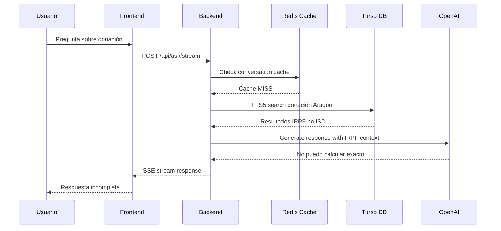
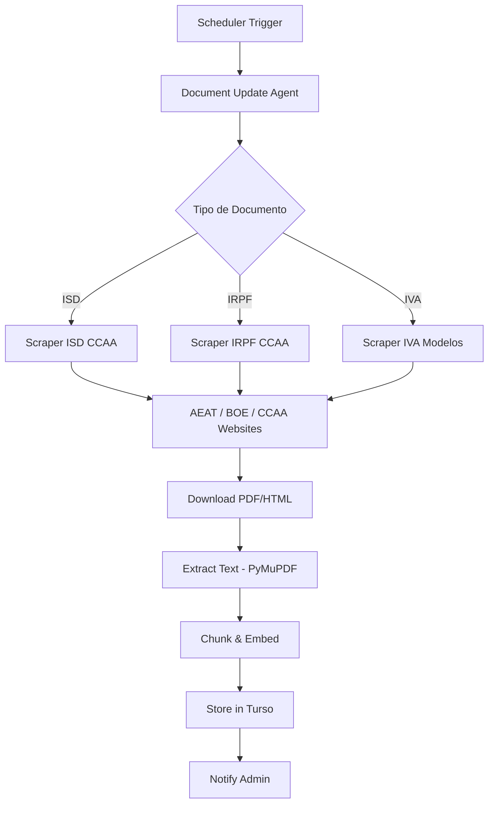

# Plan de Mejora: Memoria a Largo Plazo y Sistema RAG

> **Fecha:** 2026-02-15 (Actualizado)
> **Proyecto:** TaxIA (Impuestify)
> **Autor:** Arquitecto IA

---

## 📋 Resumen Ejecutivo

Se han identificado **4 problemas críticos** que impiden que la aplicación responda correctamente a consultas sin documentación del usuario:

1. **Falta de memoria a largo plazo** - El sistema no recuerda información del usuario entre sesiones
2. **Documentación RAG incompleta** - No hay documentos sobre Impuesto de Sucesiones y Donaciones (ISD) por CCAA
3. **Ausencia de herramienta ISD** - El TaxAgent no tiene función para calcular ISD
4. **Upstash Vector mal configurado** - El índice no tiene modelo de embeddings configurado (error en logs)

---

## 🔍 Análisis del Problema

### Caso de Uso del Usuario

```
Pregunta: "Vivo en Zaragoza y mi madre me va a donar 60000€ para la compra de una casa 
(mi primera vivienda), cuánto tendré que pagar de impuestos y en qué plazo?"
```

### Respuesta Actual del Sistema

El sistema responde que "no puede calcular un importe exacto" porque:
1. La búsqueda FTS5 encuentra documentos de IRPF (no ISD)
2. No hay herramienta `calculate_isd` disponible
3. El TaxAgent no tiene conocimiento específico sobre ISD por CCAA

### Flujo Actual (Diagrama)



---

## 🐛 Problemas Identificados

### Problema 1: Falta de Memoria a Largo Plazo

**Síntoma:** El sistema no recuerda que el usuario vive en Zaragoza entre sesiones.

**Arquitectura Actual:**
| Componente | Tipo | TTL | Propósito |
|------------|------|-----|-----------|
| `ConversationCache` | Redis | 1 hora | Contexto de conversación activa |
| `SemanticCache` | Upstash Vector | 24 horas | Caché de respuestas similares |
| `ConversationService` | Turso DB | Permanente | Historial de mensajes |

**Lo que FALTA:**
- `UserProfile` / `UserMemory` - Datos persistentes del usuario
- Preferencias fiscales (CCAA de residencia, situación laboral, etc.)
- Contexto personal recordado entre sesiones

**Ubicación en código:**
- [`backend/app/services/conversation_cache.py`](backend/app/services/conversation_cache.py:26) - TTL de 1 hora
- No existe servicio de `user_profile` o `long_term_memory`

---

### Problema 2: Documentación RAG Incompleta

**Síntoma:** La búsqueda FTS5 no encuentra información sobre ISD de Aragón.

**Análisis de la Búsqueda:**
```python
# En chat.py:74 - fts_search()
# Busca: "donación", "Aragón", "madre", "60000"
# Resultados: Tablas IRPF Aragón (no ISD)
```

**Documentos en Base de Datos (según logs del backend):**
```
docs=49, chunks=11071, embeddings=8060
```

**Documentos IDENTIFICADOS en la base de datos:**

| Documento | Tipo | Contenido |
|-----------|------|-----------|
| Manual_práctico_de_Renta_2024._Parte_1.pdf | IRPF | Tablas IRPF estatal + CCAA (páginas 1230-1245) |
| Manual_práctico_de_Renta_2024._Parte_2._Deducciones_autonómicas.pdf | IRPF | Deducciones autonómicas |
| Manual_No_Residentes_2024.pdf | IRPF No Residentes | Fiscalidad no residentes |
| Manual_Patrimonio_2024_AEAT.pdf | Patrimonio | Impuesto Patrimonio |
| Manual_Sociedades_2024_AEAT.pdf | Sociedades | Impuesto Sociedades |
| Navarra_Manual_teorico_Renta_2024.pdf | IRPF Foral | Normativa Navarra (foral) |
| cuota_autonomos_2025_infoautonomos.md | Autónomos | Cuotas RETA 2025 (15 tramos) |
| ipsi_sage_completo.md | IPSI | Impuesto Ceuta/Melilla |
| tarifa_plana_80_euros.md | Autónomos | Tarifa plana |

**Lo que FALTA (CRÍTICO):**
- ❌ **ISD por CCAA** - Impuesto Sucesiones y Donaciones (17 comunidades)
- ❌ **Tablas de reducciones por parentesco** (hijos, cónyuges, hermanos, etc.)
- ❌ **Bonificaciones por primera vivienda** por CCAA
- ❌ **Plazos de presentación** por CCAA
- ❌ **Normativa específica de donaciones** (Arancel, Ley 29/1987)

**Ubicación en código:**
- [`backend/app/routers/chat.py:74`](backend/app/routers/chat.py:74) - Función `fts_search()`
- [`backend/app/tools/search_tool.py`](backend/app/tools/search_tool.py:13) - Búsqueda web como fallback

---

### Problema 3: Ausencia de Herramienta ISD

**Síntoma:** El TaxAgent no puede calcular ISD porque no tiene la herramienta.

**Herramientas Actuales del TaxAgent:**
```python
# En tools/__init__.py
ALL_TOOLS = [
    IRPF_CALCULATOR_TOOL,        # ✅ IRPF
    AUTONOMOUS_QUOTA_TOOL,       # ✅ Cuotas autónomos
    SEARCH_TAX_REGULATIONS_TOOL, # ✅ Búsqueda web
    PAYSIP_ANALYSIS_TOOL,        # ✅ Análisis nóminas
]
# FALTA: ISD_CALCULATOR_TOOL    # ❌ Impuesto Sucesiones y Donaciones
```

**Ubicación en código:**
- [`backend/app/agents/tax_agent.py:88`](backend/app/agents/tax_agent.py:88) - System prompt menciona IRPF y autónomos, no ISD
- [`backend/app/tools/__init__.py`](backend/app/tools/__init__.py) - Lista de herramientas

---

## 💡 Soluciones Propuestas

### Solución 1: Sistema de Memoria a Largo Plazo

#### Opción A: Tabla `user_profiles` en Turso

```sql
CREATE TABLE user_profiles (
    id TEXT PRIMARY KEY,
    user_id TEXT UNIQUE NOT NULL,
    ccaa_residencia TEXT,           -- Aragón, Madrid, etc.
    situacion_laboral TEXT,         -- asalariado, autonomo, pensionista
    tiene_vivienda BOOLEAN,
    primera_vivienda BOOLEAN,
    fecha_nacimiento DATE,
    datos_fiscales JSON,            -- Flexible para otros datos
    created_at TIMESTAMP,
    updated_at TIMESTAMP,
    FOREIGN KEY (user_id) REFERENCES users(id)
);
```

**Ventajas:**
- Persistente (no expira)
- Consultable desde cualquier agente
- Compatible con GDPR (borrado en cascada)

**Implementación:**
1. Crear migración en `backend/scripts/create_user_profiles_table.py`
2. Crear servicio `backend/app/services/user_profile_service.py`
3. Modificar `TaxAgent` para consultar perfil antes de responder
4. Añadir endpoint `PUT /api/user/profile` para actualizar

#### Opción B: Memoria Semántica con Upstash Vector

```python
# Usar Upstash Vector para memoria semántica del usuario
class UserMemoryService:
    async def store_fact(self, user_id: str, fact: str, embedding: List[float]):
        """Almacena un hecho sobre el usuario con embedding"""
        
    async def recall_relevant(self, user_id: str, query: str) -> List[str]:
        """Recupera hechos relevantes del usuario"""
```

**Ventajas:**
- Búsqueda semántica (no exacta)
- Reutiliza infraestructura existente (Upstash Vector)

**Recomendación:** Implementar **Opción A** (tabla SQL) para datos estructurados + **Opción B** para hechos libres.

---

### Solución 2: Agente de Actualización Documental

#### Arquitectura del Agente



#### Fuentes de Documentos

| Tipo | Fuente | URL | Frecuencia |
|------|--------|-----|------------|
| ISD CCAA | BOE | `boe.es/buscar/ley.php?id=...` | Anual |
| IRPF CCAA | AEAT | `agenciatributaria.es` | Anual |
| Cuotas Autónomos | Seguridad Social | `seg-social.es` | Mensual |
| Modelos Tributarios | AEAT | `agenciatributaria.es` | Trimestral |

#### Implementación

```python
# backend/app/agents/document_update_agent.py

class DocumentUpdateAgent:
    """Agente que actualiza la base de documental automáticamente."""
    
    SOURCES = {
        "isd_aragon": {
            "url": "https://www.boe.es/eli/es/a/2024/...",
            "type": "ley",
            "frequency": "yearly"
        },
        # ... más fuentes
    }
    
    async def check_updates(self) -> List[DocumentUpdate]:
        """Verifica si hay actualizaciones disponibles."""
        
    async def download_and_process(self, doc_id: str) -> bool:
        """Descarga, extrae y almacena documento."""
        
    async def notify_admin(self, updates: List[DocumentUpdate]):
        """Notifica al admin de cambios detectados."""
```

#### Respeto a Rate Limits

```python
# Configuración de rate limiting para scraping
SCRAPING_CONFIG = {
    "aeat": {"requests_per_minute": 10, "delay_seconds": 6},
    "boe": {"requests_per_minute": 20, "delay_seconds": 3},
    "seg_social": {"requests_per_minute": 10, "delay_seconds": 6},
}
```

---

### Solución 3: Herramienta ISD Calculator

#### Estructura de Datos Requerida

```python
# backend/app/tools/isd_calculator_tool.py

ISD_DATA = {
    "Aragón": {
        "reducciones_parentesco": {
            "hijo": 50000,      # Reducción base hijos
            "padre": 30000,     # Reducción padres
            "hermano": 8000,    # Reducción hermanos
        },
        "bonificacion_primera_vivienda": 0.95,  # 95% bonificación
        "tarifa": [
            {"base": 0, "limite": 8000, "cuota": 0, "tipo": 0.0765},
            {"base": 8000, "limite": 16000, "cuota": 612, "tipo": 0.0850},
            # ... más tramos
        ],
        "plazo_presentacion": 30,  # días desde la donación
    },
    # ... más CCAA
}
```

#### Herramienta OpenAI Function Calling

```python
ISD_CALCULATOR_TOOL = {
    "type": "function",
    "function": {
        "name": "calculate_isd",
        "description": "Calcula el Impuesto sobre Sucesiones y Donaciones para una CCAA",
        "parameters": {
            "type": "object",
            "properties": {
                "amount": {"type": "number", "description": "Importe de la donación"},
                "ccaa": {"type": "string", "description": "Comunidad Autónoma"},
                "parentesco": {"type": "string", "enum": ["hijo", "padre", "hermano", "conyuge"]},
                "primera_vivienda": {"type": "boolean", "description": "Si es para primera vivienda"},
            },
            "required": ["amount", "ccaa", "parentesco"]
        }
    }
}
```

---

## 🚀 Plan de Implementación

### Fase 1: Memoria a Largo Plazo (Prioridad Alta)

| Tarea | Archivos | Estimación |
|-------|----------|------------|
| Crear tabla `user_profiles` | `backend/scripts/create_user_profiles_table.py` | - |
| Implementar `UserProfileService` | `backend/app/services/user_profile_service.py` | - |
| Modificar `TaxAgent` para usar perfil | `backend/app/agents/tax_agent.py` | - |
| Añadir endpoints de perfil | `backend/app/routers/user_profile.py` | - |
| Actualizar frontend | `frontend/src/pages/SettingsPage.tsx` | - |

### Fase 2: Herramienta ISD (Prioridad Alta)

| Tarea | Archivos | Estimación |
|-------|----------|------------|
| Recopilar datos ISD por CCAA | `backend/data/isd_ccaa_2025.json` | - |
| Implementar `isd_calculator_tool.py` | `backend/app/tools/isd_calculator_tool.py` | - |
| Registrar herramienta en `__init__.py` | `backend/app/tools/__init__.py` | - |
| Actualizar system prompt de TaxAgent | `backend/app/agents/tax_agent.py` | - |
| Tests unitarios | `backend/tests/test_isd_calculator.py` | - |

### Fase 3: Agente de Actualización (Prioridad Media)

| Tarea | Archivos | Estimación |
|-------|----------|------------|
| Diseñar arquitectura del agente | `backend/app/agents/document_update_agent.py` | - |
| Implementar scrapers por fuente | `backend/app/scrapers/` | - |
| Sistema de scheduling | `backend/app/scheduler.py` | - |
| Notificaciones de actualización | `backend/app/services/notification_service.py` | - |
| Panel de admin para documentos | `frontend/src/pages/AdminDocumentsPage.tsx` | - |

---

## 📊 Mejoras Futuras Recomendadas

### 1. Sistema de Feedback del Usuario

```python
# Permitir que el usuario corrija respuestas
class UserFeedback:
    conversation_id: str
    message_id: str
    rating: int  # 1-5
    correction: Optional[str]  # Texto corregido por el usuario
```

**Beneficio:** Mejora continua del sistema RAG y detección de alucinaciones.

### 2. Búsqueda Híbrida (Vector + FTS5)

```python
# Combinar búsqueda semántica con keyword
async def hybrid_search(query: str, k: int = 5):
    vector_results = await vector_search(query, k=k*2)
    fts_results = await fts_search(query, k=k*2)
    return reciprocal_rank_fusion(vector_results, fts_results, k=k)
```

**Beneficio:** Mejor recall para consultas específicas (como ISD Aragón).

### 3. Sistema de Citas y Referencias

```python
# Cada afirmación debe tener cita
class TaxResponse:
    content: str
    citations: List[Citation]
    
class Citation:
    text: str  # Texto citado
    source: str  # Documento fuente
    article: str  # Artículo de ley
    url: Optional[str]  # Link a BOE/AEAT
```

**Beneficio:** Mayor transparencia y confianza del usuario.

### 4. Multimodalidad (Imágenes de Documentos)

```python
# Procesar fotos de documentos con GPT-4 Vision
async def process_document_image(image: bytes) -> ExtractedData:
    return await gpt4_vision.extract(image)
```

**Beneficio:** Usuario puede subir fotos de notificaciones AEAT.

### 5. Integración con AEAT (API Oficial)

```python
# Conectar con API de la AEAT (si disponible)
class AEATIntegration:
    async def get_user_models(user_nif: str) -> List[Model]:
        """Obtiene modelos presentados por el usuario."""
        
    async def submit_model(model: Model) -> SubmissionResult:
        """Presenta un modelo tributario."""
```

**Beneficio:** Automatización completa del ciclo fiscal.

---

## 🔒 Consideraciones de Seguridad

### Datos de Usuario

- **GDPR Compliance:** Los perfiles de usuario deben poder eliminarse completamente
- **Encriptación:** Datos sensibles (NIF, dirección) encriptados en reposo
- **Acceso:** Solo el usuario puede ver/modificar su perfil

### Scraping Ético

- **Robots.txt:** Respetar siempre las directivas de cada sitio
- **Rate Limiting:** No sobrecargar servidores de AEAT/BOE
- **User-Agent:** Identificarse como bot educativo con contacto
- **Caching:** No descargar documentos ya existentes

---

## 📝 Próximos Pasos

1. **Validar este plan con el usuario**
2. Implementar Fase 1 (Memoria a Largo Plazo)
3. Implementar Fase 2 (Herramienta ISD)
4. Probar con el caso de uso original
5. Implementar Fase 3 (Agente de Actualización)

---

## ❓ Preguntas para el Usuario

1. ¿Prefieres que la memoria del usuario sea:
   - A) Explícita (el usuario rellena su perfil manualmente)
   - B) Implícita (el sistema aprende de las conversaciones)
   - C) Híbrida (ambas)

2. ¿Qué CCAA son prioritarias para el ISD?
   - ¿Empezamos con Aragón por el caso de uso actual?

3. ¿El agente de actualización debe ser:
   - A) Manual (el admin ejecuta cuando quiere)
   - B) Programado (ejecuta automáticamente cada X tiempo)
   - C) Event-driven (se activa cuando detecta cambios)

4. ¿Hay presupuesto para APIs externas?
   - SerpAPI para búsqueda web más fiable
   - Browserless para scraping más robusto
